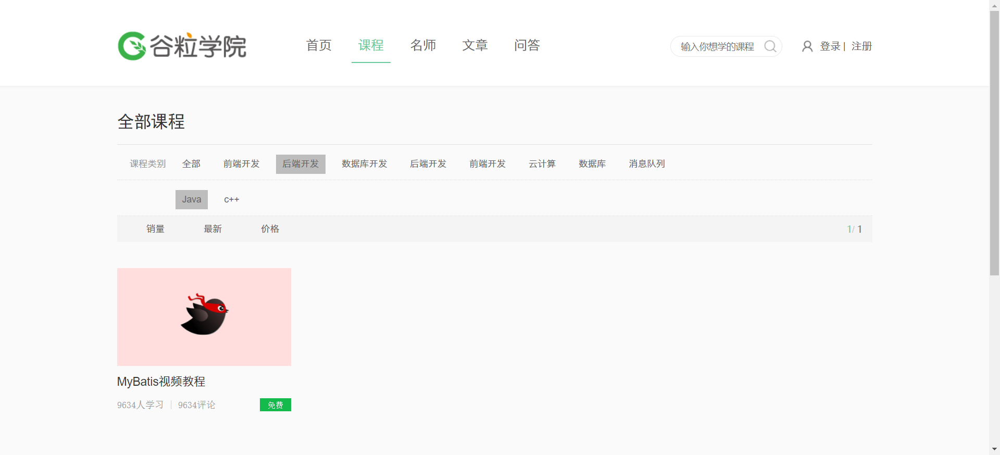

# 谷粒学院在线教育项目

## 简介

  基于SpringBoot的项目，采用B2C的商业模块，使用微服务架构，项目采用前后端分离技术；项目分为前台用户系统和后台管理系统


## 模块说明

```
education_parent
|- common                               || 公共模块
	|- common_utils                     || 存放各种工具
	|- service_base                     || 全局bean，全局设置等
	|- spring_security                  || spring_security
|- api_gateway                          || 微服务api网关
|- service									
	|- service_edu                      || 提供主要服务api接口
	|- service_oss                      || 文件上传至阿里云oss
	|- service_vod                      || 视频点播，上传至阿里云oss
	|- service_msm                      || 阿里云短信服务模块
	|- service_cms                      || 控制首页数据
	|- service_ucenter                  || 用户登录注册模块
	|- service_order                    || 订单模块
	|- service_statistic                || 统计模块
	|- service_acl                      || 后台管理权限控制
```


## 技术选型

| 框架                 | 使用内容                              | 官网                                              | 备注              | 版本  |
| -------------------- | ------------------------------------- | ------------------------------------------------- | ----------------- | ----- |
| Nacos                | 服务注册、发现、配置                  | https://nacos.io/zh-cn/index.html                 |                   | 1.4.1 |
| Spring Cloud Gateway | 服务网关，负责请求转发，负载均衡等    | https://spring.io/projects/spring-cloud-gateway   |                   |       |
| OpenFeign            | Http客户端，负责微服务之间的调用      | https://spring.io/projects/spring-cloud-openfeign |                   |       |
| MySQL                | 数据库                                | https://www.mysql.com/                            | 需要到Nacos上配置 | 5.7   |
| Redis                | 缓存数据库，为spring、mybatis提供缓存 | https://redis.io/                                 | 需要到Nacos上配置 | 5.0.9 |
| Spring Boot          | Spring快速开发的脚手架                | https://spring.io/projects/spring-boot/           |                   |       |
| Mybatis-Plus         | 为Mybatis简化开发                     | https://mp.baomidou.com/                          | 需要到Nacos上配置 |       |
| java                 |                                       |                                                   |                   | 8     |
| Swagger              | 生成接口文档                          | https://swagger.io/                               |                   |       |


## 效果图

### 教师列表


### 编辑、添加


### 课程分类列表


### 课程列表


### 添加课程步骤1


### 添加课程步骤2


### 添加课程步骤3


### 统计分析


### 前台首页


### 前台课程



### 前台课程详情


### 前台讲师详情


### 注册


### Nacos配置


